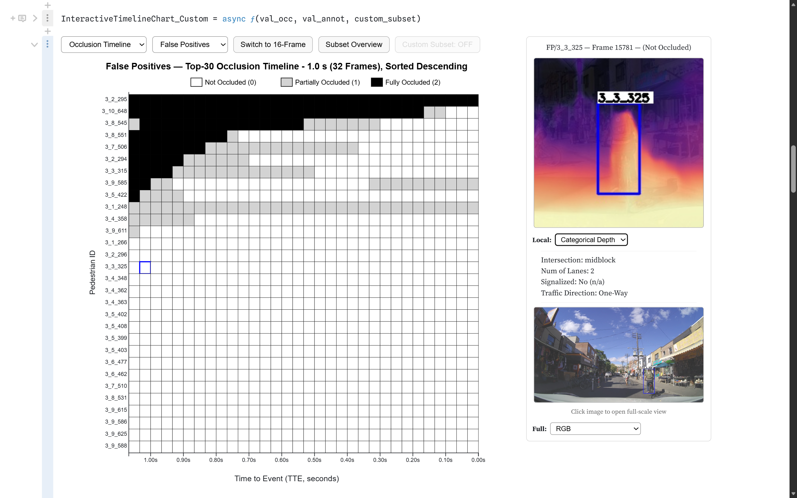

# PIPVIS Image Base



Supporting image repository for the **PIPVIS Dashboard** — an interactive visualisation and interpretability system for pedestrian intention prediction (PIP) models.

---

## Dashboard

The PIPVIS dashboard is built in Observable/D3.js and uses this repository as its image hosting backend.

🔗 **[View the PIPVIS Dashboard](https://observablehq.com/d/41ea89895dd12b44)**

### Demo

https://github.com/piyushmohan01/PIPVIS-Image-Base/blob/master/PIPVIS-Dashboard-Demo.mp4

---

## Repository Structure

```
PIPVIS-Image-Base/
│
├── Bounding-Box/               # Local context — bbox overlay (224×224)
│   └── {subset}/{ped_id}/
│
├── Body-Pose/                  # Local context — body pose overlay (224×224)
│   └── {subset}/{ped_id}/
│
├── Optical-Flow/               # Local context — RAFT optical flow (224×224)
│   └── {subset}/{ped_id}_flow_local/
│
├── Categorical-Depth/          # Local context — categorical depth (224×224)
│   └── {subset}/{ped_id}_depth_global/
│
├── Full-Scale-BBox/            # Full-scale RGB frame with bbox overlay
│   └── {subset}/{ped_id}_full_scale/
│
├── Full-Scale-Semantic/        # Full-scale semantic segmentation overlay
│   └── {subset}/{ped_id}_full/
│
├── Manifest-Files/             # Manifest JSON files and generation scripts
│   ├── manifest.json               # Bounding Box image URLs
│   ├── manifest_pose.json          # Body Pose image URLs
│   ├── manifest_flow.json          # Optical Flow image URLs
│   ├── manifest_depth.json         # Categorical Depth image URLs
│   ├── manifest_full.json          # Full-Scale RGB image URLs
│   ├── manifest_full_sem.json      # Full-Scale Semantic image URLs
│   ├── manifest_bbox.py            # Bounding Box manifest generator
│   ├── manifest_pose.py            # Body Pose manifest generator
│   ├── manifest_flow.py            # Optical Flow manifest generator
│   ├── manifest_depth.py           # Categorical Depth manifest generator
│   ├── manifest_full.py            # Full-Scale RGB manifest generator
│   └── manifest_full_sem.py        # Full-Scale Semantic manifest generator
│
├── Data-Prep/                  # Data preparation notebooks and dashboard datasets
│   ├── annot-data/                 # Raw annotation data
│   ├── obd-data/                   # On-board diagnostic (vehicle speed) data
│   ├── occ-data/                   # Occlusion data
│   ├── PIE_annot_attrb_val.csv     # Pedestrian annotation attributes (validation)
│   ├── PIE_val_all_updated.csv     # Combined validation dataset (all features)
│   ├── PIE_val_occ_updated.csv     # Occlusion timeline dataset
│   ├── PIE_val_vehicle.csv         # Ego-vehicle OBD speed dataset
│   ├── data-prep-01.ipynb          # Data preparation notebook — stage 1
│   ├── data-prep-02.ipynb          # Data preparation notebook — stage 2
│   └── data-prep-03.ipynb          # Data preparation notebook — stage 3
│
├── Image-Prep/                 # Image extraction and processing pipeline
│   └── image-extraction.ipynb     # Extraction notebook for all six image types
│
├── Project-Screenshots/        # Dashboard and project screenshots
│
├── PIPVIS-Dashboard-Demo.mp4   # Clipped dashboard demo video
└── .gitignore                  # Excludes environment files and large assets
```

**Subsets:** `FN` (False Negatives) · `FP` (False Positives) · `TP` (True Positives) · `TN` (True Negatives)

---

## Manifests

Each manifest is a JSON file mapping `subset → ped_id → frame_number → image URL`, located in `Manifest-Files/`.

```json
{
  "FN": {
    "3_2_290": {
      "frames": {
        "5530": "https://raw.githubusercontent.com/.../frame_5530_bbox.jpg",
        "5531": "https://raw.githubusercontent.com/.../frame_5531_bbox.jpg"
      }
    }
  }
}
```

| Manifest | Image Type | Local / Full | Size |
|---|---|---|---|
| `manifest.json` | Bounding Box | Local | 224×224 |
| `manifest_pose.json` | Body Pose | Local | 224×224 |
| `manifest_flow.json` | Optical Flow (RAFT) | Local | 224×224 |
| `manifest_depth.json` | Categorical Depth | Local | 224×224 |
| `manifest_full.json` | RGB Full-Scale | Full | Original |
| `manifest_full_sem.json` | Semantic Segmentation Full-Scale | Full | Original |

> **Note for dashboard use:** Manifests should be fetched via `raw.githack.com` rather than `raw.githubusercontent.com` to satisfy CORS requirements in Observable.
>
> ```
> https://raw.githack.com/piyushmohan01/PIPVIS-Image-Base/master/Manifest-Files/manifest.json
> ```

---

## Data Preparation

The `Data-Prep/` folder contains three staged data preparation notebooks and the four processed CSV datasets used directly by the PIPVIS dashboard.

| File | Description |
|---|---|
| `PIE_annot_attrb_val.csv` | Pedestrian annotation attributes for the validation set |
| `PIE_val_all_updated.csv` | Combined dataset — all features, used by the Treemap and Ego-Speed charts |
| `PIE_val_occ_updated.csv` | Occlusion timeline dataset — used by the Timeline charts |
| `PIE_val_vehicle.csv` | Ego-vehicle OBD speed dataset — used by the Ego-Speed Distribution chart |

Raw source data (FN, FP, TP, TN) is organised in three subfolders: `annot-data/`, `obd-data/`, and `occ-data/`.

---

## Image Preparation

The `Image-Prep/` folder contains a single notebook covering all six visual processing pipelines used to generate the image sets hosted in this repository.

- **Bounding Box** — squarified local context crop
- **Body Pose** — OpenPose skeleton overlay
- **Optical Flow** — RAFT local context (224×224)
- **Categorical Depth** — ManyDepth global crop
- **Full-Scale RGB** — full-frame with bbox overlay
- **Full-Scale Semantic** — full-frame with DeepLabV3+ segmentation overlay

---

## Dataset & Model

Images are derived from the **[PIE Dataset](http://data.nvision2.eecs.yorku.ca/PIE_dataset/)** (Pedestrian Intention Estimation) and processed through the **PIP-Net** model pipeline.

---

## Project

PIPVIS is funded by **MAVIS** (EPSRC EP/X029689/1) and **Hi-Drive** (EU Horizon 2020, grant 101006664), developed at the **Leeds Institute for Data Analytics (LIDA), University of Leeds**.

| Role | Person |
|---|---|
| Lead Data Scientist | Piyush Mohan |
| Lead Supervisor · PIP Expert | Dr. Mahdi Rezaei |
| Supervisor · XAI Visualisation | Prof. Roy Ruddle |
| Team Member · PIP Expert | Mohsen Azarmi |
| Team Member · XAI Visualisation | Dr. Liqun Liu |
| External Partner · SYSTRA UK & Ireland | Dr. Patrizia Franco |

---

## Related

- 📄 Paper accepted for **Digital Footprints 2026**
- 💻 Dashboard: [Observable notebook](https://observablehq.com/d/41ea89895dd12b44)
- 🗂️ Manifest generation scripts: `Manifest-Files/`
